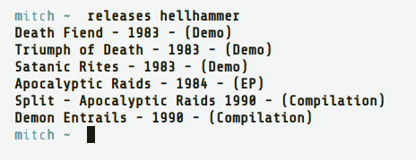
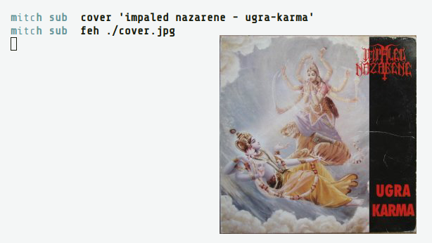
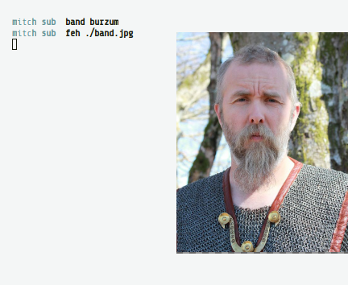
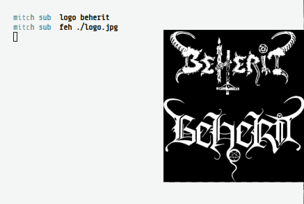
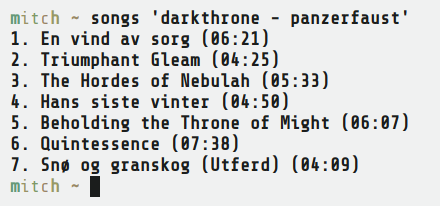
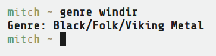
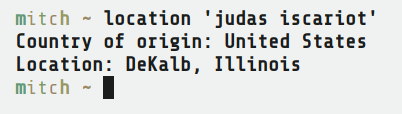

# metal-archives web scrapers

Helpful scripts to get information from http://metal-archives.com

## installation

1. install `python3` and `python3-pip` from your package manager (UNIX), or http://python.org/getit/windows (Windows)
2. install the required libs: `pip3 install -r requirements.txt`
3. put them somewhere in your `$PATH`, (or alternatively run `sudo make install`)

## screenshots

### releases

### cover

### band

### logo

### lyrics

### songs

### genre

### location

------

Originally these were methods from an old chat bot.  
But as they are so handy, I now use them to categorize and tag my music.
